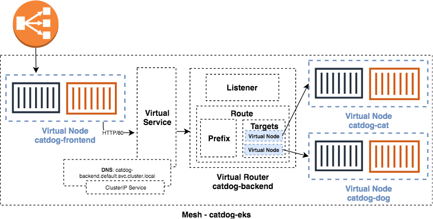
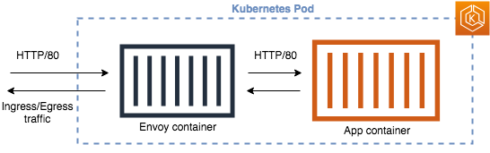

# App Mesh Demo

This repo includes Kubernetes manifests and App Mesh configuration to launch two services to demonstrate a basic web application.



- **frontend**: An nginx web server that passes connections to the backend service. This is configured as a `type: LoadBalancer` Kubernetes Service, a Classic Load Balancer (CLB) will be created for ingress requests.

- **backend**: A Python web application which serves random cat, or dog GIFs. These are abstracted as two separate Kubernetes ClusterIP Services, requests can be weighted between these as targets in the App Mesh rules.

Each Service contains Pods configured with the Envoy proxy alongside the application container.



### You'll need:
- Access to a Kubernetes cluster running in AWS, if you haven't got one check out [eksctl](https://eksctl.io/)
- kubectl configured for this cluster on your laptop/workstation
- AWS CLI (v1.16.133 or newer) installed with credentials configured
- Permissions to create and manage App Mesh resources

# Lets begin!

### Clone this repo

```bash
git clone https://github.com/dkeightley/App-Mesh-Demo.git`
cd App-Mesh-Demo
```

### Configuration changes

The demo should work as it is, however if you want to, at this point you can alter any configuration like frontend the 'type: LoadBalancer' Service can be changed to avoid creating a CLB.

### Deploy the components

```bash
./deploy create
```

### Access the demo

To access the demo, you can obtain the Load Balancer DNS name and load this in a browser.

```bash
kubectl get svc catdog-frontend -o wide
```

You should see the `EXTERNAL-IP` column containing a DNS name for the CLB. Once it has had time to provision you can load this in a browser.

The route is currently configured with a 100% weight to the 'catdog-dog' Service, this serves dog GIFs.

### Update the route

Edit the route-backend.json file, adjust the weight for the targets to your choosing.

```bash
./deploy update-routes
```

Within a short period of time, further loads of the website will load according to the weight configured.

You can also watch this by grepping for 'response' in the website content, for example:

```bash
while true                                                    
  do
    curl -s <clb-dns-name-here> | grep response
    sleep .5
done
```

## Notes

There is a `kubernetes-optional` directory with an Ingress configuration for an alb-ingress-controller and modified `frontend.yml` if you would rather use this.
